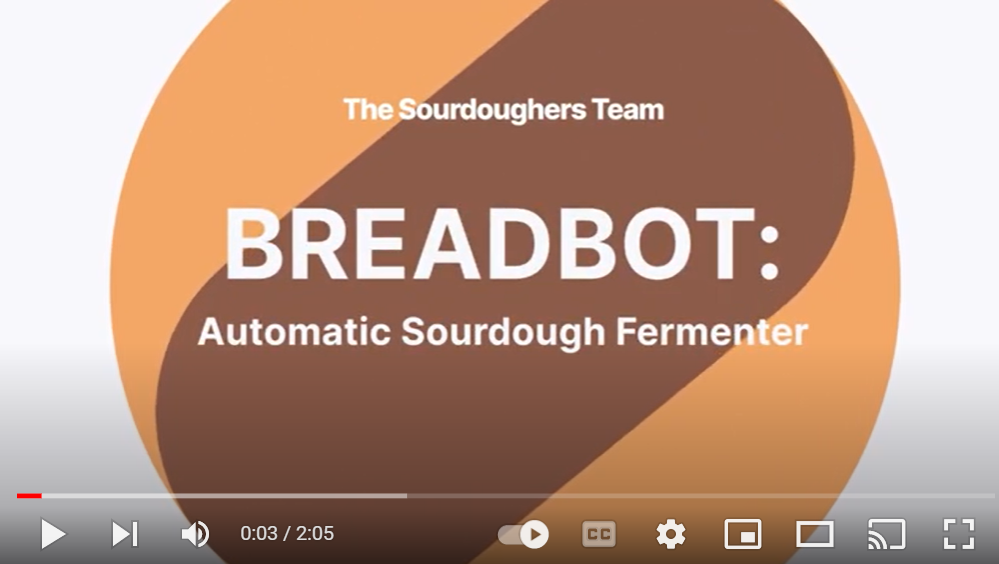

# CHOLULA BREADBOT: Sourdough Automatic Fermenter and Quality Inspector

## Team: The Sourdoughers
- [Karolay De La Cruz](https://www.linkedin.com/in/karolay-de-la-cruz/)
- [Fernanda Rodríguez](https://www.linkedin.com/in/mfernandaroeg/)


## Description
This project is part of the top 50 finalist in OAKDLiteContest. The BreadBot, is a prototype proposed to automate the 
process of fermentation of sourdough, a solution that allows increasing the production of healthy sourdough bread. With 
this application we want to  leverage the power of technology to create a sustainable, environmentally friendly, 
and healthy way of living by incorporating technology into artisan processes. 

We are capable of monitoring the appearance and height of the dough thanks to the enormous power and potential of 
the OAKDLite. Additionally, LEGO Mindstorms Robot Inventor kit is used to navigate between flour/water containers and to
mix the dough.

[](https://www.youtube.com/watch?v=OJnjwUVRSP4)

## Dataset
The dataset of our quality inspector is conformed of 400 jpg images in which the state of the sourdough was captured 
seen from the top of its container, it is located in "dataset/Original". Also, The "dataset/Current Approach" folder 
contains images captured from another angle to compare their performance in quality control.
In addition, we are currently acquiring more images to increase our database and improve our model quality control.

## Hardware
Our hardware design was made with the Mindstorms Robot Inventor kit with which we created the following parts of the solution:
-	Breadbot
-	Mixer mechanism

Another of the elements used for the implementation of the project are listed below:
-	OAK-D-LITE (Located at a fixed point 50cm from the ground)
-	Raspberry Pi 4B
-	Electro valve
-	Servomotors
-	Relay
-	Containers for mix, flour, and water
-	Tape
-	Container lid
-	Mixing tool


## Software
-	**Depth & appearance quality control**: This script is the one that runs on OAKD-Lite a custom made tiny YOLO v4 
model in order to detect the sourdough and its quality.


```
   QualityControl.py

    Input:
    - OAKD-Lite frames
    
   Output:
    - Good Quality: Let the sourdough rest
    - Bad Quality: Need to feed sourdough 
    - Empty: Add elements to the container  
    - Sourdough height in cm
```   

-	**Robot control & navigation**: this script establish bluetooth communication between the Lego 
controller and Raspberry pi.
```
    RobotControl.py
     
    Input:
    - Color sensor 
    - Appearance output
    
    Output:    
    - Navigation instructions
```      


